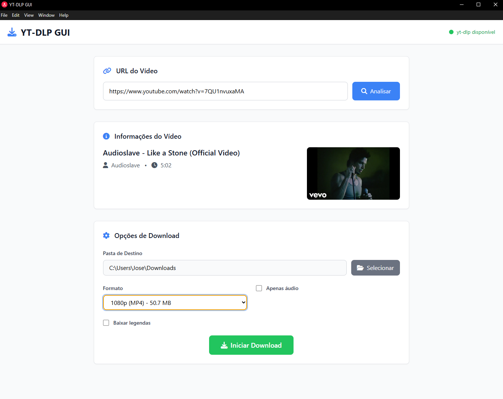

# YTDLP GUI APP

<div align="center">



**Uma interface gráfica moderna e intuitiva para o yt-dlp**

[](https://opensource.org/licenses/MIT)
[](https://nodejs.org/)
[](https://electronjs.org/)
[]()

</div>

## 📖 Sobre o Projeto

O YTDLP GUI APP é uma interface gráfica moderna e user-friendly para o poderoso yt-dlp, permitindo que você baixe vídeos e áudios de mais de 1000 sites de forma simples e intuitiva, sem precisar usar linha de comando.

### 🎯 Por que usar?

- **Simplicidade**: Interface gráfica amigável para quem não gosta de linha de comando
- **Versatilidade**: Suporte a 1000+ sites de vídeo
- **Performance**: Downloads simultâneos com monitoramento em tempo real
- **Qualidade**: Múltiplos formatos e qualidades disponíveis
- **Gratuito**: 100% open source e sem custos

## ✨ Principais Funcionalidades

### 🎬 Download de Vídeos

- Análise automática com preview de thumbnail
- Múltiplas qualidades (4K, 1080p, 720p, etc.)
- Formatos variados (MP4, WEBM, MKV)

### 🎵 Download de Áudio

- Extração de áudio em alta qualidade
- Formatos: MP3, M4A, WAV, FLAC
- Configuração de bitrate

### 📝 Legendas

- Download automático de legendas
- Múltiplos idiomas suportados
- Legendas auto-geradas quando disponíveis

### ⚡ Recursos Avançados

- Downloads simultâneos
- Monitoramento de progresso em tempo real
- Seleção de pasta de destino
- Cancelamento de downloads
- Interface responsiva e moderna

## 🌐 Sites Suportados

YouTube, Twitch, Twitter/X, Instagram, TikTok, Facebook, Vimeo, Dailymotion, e mais de 1000 outros sites.

<details>
<summary>Ver lista completa de sites suportados</summary>

Execute `yt-dlp --list-extractors` após a instalação para ver todos os sites suportados.

</details>

## 🚀 Instalação

### Pré-requisitos

Certifique-se de ter instalado:

#### 1. Node.js (versão 16 ou superior)

```bash
# Verificar versão instalada
node --version
```

📥 [Download Node.js](https://nodejs.org/)

#### 2. yt-dlp

<details>
<summary><strong>Windows</strong></summary>

```bash
# Opção 1: Via pip (recomendado)
pip install yt-dlp

# Opção 2: Via winget
winget install yt-dlp

# Opção 3: Executável standalone
# Baixe de: https://github.com/yt-dlp/yt-dlp/releases
```

</details>

<details>
<summary><strong>macOS</strong></summary>

```bash
# Via Homebrew (recomendado)
brew install yt-dlp

# Via pip
pip install yt-dlp
```

</details>

<details>
<summary><strong>Linux</strong></summary>

```bash
# Ubuntu/Debian
sudo apt update && sudo apt install yt-dlp

# Via pip
pip install yt-dlp

# Arch Linux
sudo pacman -S yt-dlp
```

</details>

#### 3. FFmpeg (opcional, mas recomendado)

<details>
<summary>Instruções de instalação do FFmpeg</summary>

**Windows:**

```bash
winget install FFmpeg
```

**macOS:**

```bash
brew install ffmpeg
```

**Linux (Ubuntu/Debian):**

```bash
sudo apt install ffmpeg
```

</details>

### Instalação do Aplicativo

1. **Clone o repositório:**

```bash
git clone https://github.com/zerobertoo/ytdlp-gui-app.git
cd ytdlp-gui-app
```

2. **Instale as dependências:**

```bash
npm install
```

3. **Execute a aplicação:**

```bash
npm start
```

## 🎮 Como Usar

### 1️⃣ Análise de Vídeo

1. Cole a URL do vídeo no campo de entrada
2. Clique em **"Analisar"** ou pressione `Enter`
3. Aguarde o carregamento das informações do vídeo

### 2️⃣ Configuração do Download

- **📁 Pasta de Destino**: Selecione onde salvar os arquivos
- **🎬 Formato**: Escolha a qualidade e formato desejado
- **🎵 Apenas Áudio**: Marque para extrair apenas o áudio
- **📝 Legendas**: Ative para incluir legendas (especifique idiomas se necessário)

### 3️⃣ Download

1. Clique em **"Iniciar Download"**
2. Acompanhe o progresso na barra inferior
3. Use **"Cancelar"** para interromper downloads se necessário

## 🛠️ Scripts de Desenvolvimento

```bash
# Desenvolvimento com hot reload
npm run dev

# Executar aplicação
npm start

# Build para todas as plataformas
npm run build

# Build específico por plataforma
npm run build-win     # Windows
npm run build-mac     # macOS
npm run build-linux   # Linux
```

## 📁 Estrutura do Projeto

```
ytdlp-gui-app/
├── main.js              # Processo principal do Electron
├── preload.js           # Bridge de segurança Electron
├── package.json         # Dependências e configurações
├── src/
│   ├── index.html       # Interface principal
│   ├── renderer.js      # Lógica da interface
│   └── styles.css       # Estilos customizados
├── assets/
│   └── icons/           # Ícones da aplicação
└── dist/                # Arquivos de build (gerado)
```

## 🔧 Solução de Problemas

<details>
<summary><strong>❌ "yt-dlp não encontrado"</strong></summary>

```bash
# Verificar se está no PATH
yt-dlp --version

# Se não funcionar, reinstale
pip install --upgrade yt-dlp

# Windows: adicionar ao PATH manualmente se necessário
```

</details>

<details>
<summary><strong>🔒 Erro de permissão (Windows)</strong></summary>

- Execute o terminal como Administrador
- Ou adicione o yt-dlp ao PATH manualmente
- Verifique se o antivírus não está bloqueando

</details>

<details>
<summary><strong>📦 Erro de dependências Node.js</strong></summary>

```bash
# Limpar cache e reinstalar
rm -rf node_modules package-lock.json
npm cache clean --force
npm install
```

</details>

<details>
<summary><strong>🎵 Problemas com conversão de áudio</strong></summary>

- Instale o FFmpeg (instruções acima)
- Reinicie a aplicação após instalar FFmpeg
- Verifique se FFmpeg está no PATH: `ffmpeg -version`

</details>

## 🔒 Privacidade e Segurança

- ✅ **Dados locais**: Todas as operações são realizadas localmente
- ✅ **Sem telemetria**: Não coletamos dados de uso
- ✅ **Open source**: Código 100% auditável
- ✅ **Sem ads**: Interface limpa e sem publicidade

## 🤝 Contribuindo

Contribuições são muito bem-vindas! Veja como ajudar:

1. 🍴 Fork o projeto
2. 🌿 Crie uma branch para sua feature:
   ```bash
   git checkout -b feature/minha-nova-feature
   ```
3. 💾 Commit suas mudanças:
   ```bash
   git commit -m 'feat: adiciona nova funcionalidade X'
   ```
4. 📤 Push para a branch:
   ```bash
   git push origin feature/minha-nova-feature
   ```
5. 🔄 Abra um Pull Request

### 💡 Ideias para Contribuição

- 🌍 Tradução para outros idiomas
- 🎨 Melhorias na interface
- 🐛 Correção de bugs
- 📚 Melhoria da documentação
- ⚡ Otimizações de performance

## 📊 Roadmap

- [ ] 🌍 Suporte a múltiplos idiomas
- [ ] 📋 Lista de downloads salvos
- [ ] 🎵 Player de áudio integrado
- [ ] 📱 Versão mobile (PWA)
- [ ] 🔄 Auto-updater
- [ ] 🎯 Playlists e downloads em lote

## 📄 Licença

Este projeto está licenciado sob a Licença MIT - veja o arquivo [LICENSE](LICENSE) para detalhes.

## 🙏 Créditos

Este projeto foi possível graças a:

- 🎬 [yt-dlp](https://github.com/yt-dlp/yt-dlp) - A engine de download
- ⚡ [Electron](https://electronjs.org/) - Framework desktop
- 🎨 [Tailwind CSS](https://tailwindcss.com/) - Framework CSS
- 🎯 [Font Awesome](https://fontawesome.com/) - Ícones

## 📞 Suporte

Encontrou um problema? Precisa de ajuda?

1. 🔍 Verifique os [Issues existentes](https://github.com/zerobertoo/ytdlp-gui-app/issues)
2. 🆕 Crie um novo Issue se necessário
3. 📝 Inclua detalhes sobre:
   - Sistema operacional
   - Versão do Node.js
   - Logs de erro

## 💖 Apoie o Projeto

Se este projeto te ajudou, considere:

- ⭐ Dar uma estrela no GitHub
- 🐛 Reportar bugs
- 💡 Sugerir melhorias
- 🤝 Contribuir com código
- 📢 Compartilhar com amigos

---

<div align="center">

**Desenvolvido com ☕ e ❤️ por [zerobertoo](https://github.com/zerobertoo)**

[](https://github.com/zerobertoo)

</div>
